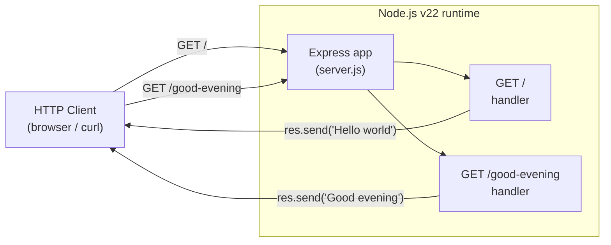

# Technical Specification

# 0. Agent Action Plan

## 0.1 Intent Clarification

This Agent Action Plan is the Blitzy platform's authoritative interpretation of the user's request to add a feature to the existing repository. It restates the requirement with technical precision, surfaces implicit prerequisites that the request assumes but the repository does not yet contain, maps every requirement to concrete files and components, and defines exhaustive scope boundaries for downstream code-generation agents.

### 0.1.1 Core Feature Objective

Based on the prompt, the Blitzy platform understands that the new feature requirement is to **introduce the Express.js web framework into the project and expose a second HTTP endpoint that returns the response `Good evening`, while continuing to serve the existing `Hello world` response.**

**User Request (verbatim):**

> add feature to a existing product
>
> this is a tutorial of node js server hosting one endpoint that returns the response "Hello world". Could you add expressjs into the project and add another endpoint that return the reponse of "Good evening"?

The request decomposes into the following requirements, restated with enhanced clarity:

| ID | Requirement (restated) | Type |
|----|------------------------|------|
| R1 | Establish a runnable Node.js project baseline (dependency manifest + server entry file) that the request assumes already exists | Implicit prerequisite |
| R2 | Introduce Express.js as the project's HTTP framework and managed dependency | Explicit |
| R3 | Preserve an endpoint that returns exactly `Hello world` | Explicit (backward compatibility) |
| R4 | Add a new endpoint that returns exactly `Good evening` | Explicit |

**Critical context — the described "existing product" is not present in the repository.** The prompt refers to a pre-existing "tutorial node js server", but the repository contains no such code. The repository root holds exactly one file, `README.md`, whose entire content is the single heading `# Artifact2` [README.md:L1]. This is corroborated by the Technical Specification's own inventory, which reports 1 total file, 0 subdirectories, and 0 lines of source code [Technical Specification §1.4.1], and by the technology-stack assessment reporting 0 frameworks, 0 libraries, and 0 open-source dependencies [Technical Specification §3.1.1]. Consequently, requirement R1 is an unavoidable implicit prerequisite: the Blitzy platform must first **create** the baseline server the user believes exists, then layer the Express.js feature on top of it.

**Implicit requirements surfaced:**

- A dependency manifest (`package.json`) is required to declare and resolve the Express.js dependency; none exists today [Technical Specification §3.1.1].
- A server entry file (recommended `server.js`) is required to host the Express application and its routes.
- The Express application must bind to a listening port (recommended `process.env.PORT || 3000`) to be reachable.
- A lock file (`package-lock.json`) will be generated by dependency installation to guarantee reproducible builds.
- A `.gitignore` is required to exclude the generated `node_modules/` directory from version control (standard Node.js hygiene).
- `README.md` should be updated to document install/run instructions and the two endpoints, aligning with the artifact the Technical Specification flags as needed for project substantiation [Technical Specification §1.4.3].

**Feature dependencies and prerequisites:**

- **Runtime:** Node.js (verified present at v22.22.2), which satisfies Express 5's minimum requirement of Node.js 18+.
- **Package:** `express` (npm), resolved at install time and pinned in the manifest.
- **Sequencing:** R1 (baseline) → R2 (add Express) → R3/R4 (define both routes). R3 and R4 are implemented together within the same Express application.

### 0.1.2 Special Instructions and Constraints

- **Framework directive (explicit):** The HTTP layer must be implemented with **Express.js specifically** — "add expressjs into the project". A native `http`-module-only implementation does not satisfy the request.
- **Backward-compatibility directive:** The original behavior must be retained. After the change, a request to the server must still be able to obtain the `Hello world` response. The new endpoint is **additive**, not a replacement.
- **Exact response strings (preserve verbatim):** The endpoint payloads must be exactly:
  - User Example (existing response): `Hello world`
  - User Example (new response): `Good evening`
- **Architectural conventions:** Because the repository is greenfield with no established conventions [Technical Specification §3.1.1], the implementation will follow idiomatic minimal-tutorial Express conventions — CommonJS (`require`) module style and a single-file server appropriate to the tutorial scale described by the user.
- **Web-search requirement:** Determination of the correct, currently valid Express version was required and performed (see Section 0.2.2); no placeholder version is used.

### 0.1.3 Technical Interpretation

These feature requirements translate to the following technical implementation strategy. Each requirement maps to a concrete create/modify action against specific components:

| Requirement | Technical Action |
|-------------|------------------|
| R1 — baseline project | To establish a runnable project, we will **create** `package.json` (manifest with a `start` script) and a server entry file `server.js`. |
| R2 — introduce Express | To introduce Express, we will **add** `express` (`^5.2.1`) to `package.json` dependencies and **require** it in `server.js` (`const express = require('express'); const app = express();`). |
| R3 — preserve "Hello world" | To preserve the original response, we will **define** a route `app.get('/', (req, res) => res.send('Hello world'));`. |
| R4 — add "Good evening" | To add the new response, we will **define** a route `app.get('/good-evening', (req, res) => res.send('Good evening'));`. |
| Runtime binding | To make the server reachable, we will **invoke** `app.listen(PORT, ...)` with `PORT = process.env.PORT || 3000`. |

The recommended route paths (`/` for `Hello world`, `/good-evening` for `Good evening`) are documented defaults; the prompt does not fix endpoint paths, so these are reasonable, self-descriptive choices that keep the original response at the server root for maximal backward compatibility.

## 0.2 Repository Scope Discovery

A comprehensive inspection of the repository was performed to identify every file that the feature touches — both the existing files that must change and the new files that must be created.

### 0.2.1 Comprehensive File Analysis

The repository was traversed exhaustively (root listing, full recursive file search, and an inspection across all branches, refs, and stashes). The complete inventory is a single file:

| Path | Status | Description |
|------|--------|-------------|
| `README.md` | Existing (UPDATE) | Sole tracked file; entire content is the heading `# Artifact2` [README.md:L1] |
| `` (repository root) | Existing | Flat directory; 0 subdirectories, 0 source files [Technical Specification §1.4.1] |

**Integration-point discovery.** Because the repository is greenfield, there are **no pre-existing integration points** to modify — every integration surface for this feature is net-new and created from scratch:

- **API endpoints:** None exist today; the two GET routes will be the first endpoints in the project.
- **Database models / migrations:** Not applicable — the feature serves static strings and requires no persistence [Technical Specification §3.1.1].
- **Service classes:** None exist and none are required; route handlers are trivial inline functions.
- **Controllers / handlers:** Created net-new as inline Express route handlers in `server.js`.
- **Middleware / interceptors:** None required for the minimal feature; the default Express middleware stack is sufficient.

No `.blitzyignore` file exists in the repository, so there are no ignore patterns constraining this analysis.

### 0.2.2 Web Search Research Conducted

Because the prompt requires introducing Express.js but does not pin a version, research was conducted to identify the exact, currently valid release to declare in the manifest (avoiding placeholder versions):

- **Latest stable Express version:** `5.2.1`, confirmed via the npm registry (`npm view express version` → `5.2.1`) and the npm package page. This is the version the plan declares as `^5.2.1`.
- **Recommended major line:** Express 5 is the Express Technical Committee's production-recommended release line; Express 4 has entered maintenance. Adopting Express 5.x is therefore correct for a new project.
- **Runtime compatibility:** Express 5 requires Node.js 18 or higher; the environment provides Node.js v22.22.2, which satisfies this comfortably.

No further library research is required — the feature is minimal and introduces only the single `express` dependency.

### 0.2.3 New File Requirements

The following new files must be created to deliver the feature:

- `package.json` — Project dependency manifest: declares `express` (`^5.2.1`), a `start` script (`node server.js`), the `main` entry, and (optionally) an `engines.node >=18` constraint.
- `server.js` — Express application entry point: instantiates the app, registers the two GET routes (`Hello world`, `Good evening`), and starts the listener.
- `.gitignore` — Excludes the generated `node_modules/` directory (and optionally log/env files) from version control.
- `package-lock.json` — Generated automatically by `npm install`; records the fully resolved dependency tree (including Express's transitive dependencies) for reproducible installs.

No new test, configuration-directory, or documentation-directory files are required for this minimal feature beyond those listed above; automated tests and additional configuration are documented as out of scope in Section 0.6.

## 0.3 Dependency Inventory

This feature introduces exactly one new direct dependency. The repository currently declares zero dependencies of any ecosystem [Technical Specification §3.1.1], so there are no version conflicts, peer-dependency reconciliations, or removals to manage.

### 0.3.1 Package Additions

| Package | Registry | Version | Type | Purpose |
|---------|----------|---------|------|---------|
| `express` | npm | `^5.2.1` | dependency (runtime) | HTTP web framework providing the application object (`express()`), routing (`app.get`), and response helpers (`res.send`) used to serve both endpoints |

- The version `5.2.1` is the current latest stable release verified against the npm registry; it is declared with a caret range (`^5.2.1`) to permit compatible patch/minor updates within the Express 5 line.
- Express's transitive dependencies (its internal router, body-parser, and related packages) are resolved automatically by `npm install` and recorded in `package-lock.json`; they require no manual declaration or action.
- **No `devDependencies` are required** for this minimal feature. Tooling such as test runners or `nodemon` is intentionally excluded (see Section 0.6).

### 0.3.2 Manifest and Lock-File Changes

- `package.json` (CREATE): add the `dependencies` block declaring `express`, plus project metadata (`name`, `version`, `main`, `scripts.start`).
- `package-lock.json` (CREATE / generated): produced by `npm install` to lock the resolved dependency graph for reproducible installs; committed to the repository.

### 0.3.3 Import / Reference Updates

Because the repository contains no existing source files [Technical Specification §1.4.1], there are **no existing import statements to migrate or rewrite**. The only module reference introduced is the new CommonJS import in `server.js`:

```js
const express = require('express');
```

No configuration files, build files, or CI/CD manifests currently exist, so no external-reference updates are required beyond the new files enumerated in Section 0.2.3.

## 0.4 Integration Analysis

Because the repository is greenfield [Technical Specification §1.4.1], "integration" for this feature consists of wiring the new files to one another and to the Node.js runtime, rather than modifying existing code. There are no existing call sites, dependency-injection containers, schemas, or route registries to amend.

### 0.4.1 Existing Code Touchpoints

| Touchpoint | File | Action | Detail |
|------------|------|--------|--------|
| Project manifest | `package.json` | CREATE | Declare `express` dependency and `start` script; bind `main` to `server.js` |
| Server bootstrap | `server.js` | CREATE | `require('express')`, instantiate `app`, register routes, call `app.listen(PORT)` |
| Route registration — existing response | `server.js` | CREATE | `app.get('/', ...)` returning `Hello world` |
| Route registration — new response | `server.js` | CREATE | `app.get('/good-evening', ...)` returning `Good evening` |
| Lock file | `package-lock.json` | CREATE (generated) | Captures resolved dependency tree via `npm install` |
| VCS hygiene | `.gitignore` | CREATE | Exclude `node_modules/` |
| Documentation | `README.md` | UPDATE | Add install/run instructions and endpoint reference; preserve `# Artifact2` heading [README.md:L1] |

- **Dependency injection / service wiring:** Not applicable — no DI container exists or is needed; route handlers are inline functions.
- **Database / schema updates:** Not applicable — the feature has no persistence layer [Technical Specification §3.1.1].

### 0.4.2 Runtime Request Flow

The following diagram shows how the new components interact at runtime to satisfy both endpoints:



### 0.4.3 Build and Install Wiring

The components are connected through the npm lifecycle and the Node module system:

- `package.json` → `express`: the `dependencies` entry causes `npm install` to fetch Express and populate `node_modules/` and `package-lock.json`.
- `server.js` → `express`: `require('express')` resolves the installed package at startup.
- `package.json` → `server.js`: `scripts.start` (`node server.js`) and `main` make `npm start` the canonical run command.
- Node runtime → Express: Node v22.22.2 satisfies Express 5's Node 18+ requirement, so no runtime upgrade is needed.

## 0.5 Technical Implementation

This subsection enumerates every file the implementation must create or modify, the approach for each, and the validation that confirms success. Every file listed here is actionable — none is a passive reference.

### 0.5.1 File-by-File Execution Plan

**Group 1 — Project Foundation**

- **CREATE** `package.json` — Dependency manifest. Declares project metadata, the `start` script, and the `express` (`^5.2.1`) dependency. This is the artifact whose absence the Technical Specification flags as blocking technology-stack definition [Technical Specification §3.1.1].

**Group 2 — Core Feature (server + routes)**

- **CREATE** `server.js` — Express application entry point. Requires Express, instantiates the app, registers the `Hello world` route (preserving original behavior, R3) and the `Good evening` route (new, R4), and starts the HTTP listener.

**Group 3 — Hygiene, Lock File, and Documentation**

- **CREATE** `.gitignore` — Excludes `node_modules/` from version control.
- **CREATE** `package-lock.json` — Generated by `npm install`; locks the resolved dependency graph.
- **UPDATE** `README.md` — Preserves the existing `# Artifact2` heading [README.md:L1] and adds an overview, prerequisites, install/run instructions, and an endpoint reference table.

### 0.5.2 Implementation Approach per File

- **`package.json`** — Establish the project foundation. Minimal shape:

```json
{ "name": "artifact2", "version": "1.0.0", "main": "server.js",
  "scripts": { "start": "node server.js" },
  "dependencies": { "express": "^5.2.1" } }
```

- **`server.js`** — Integrate the framework and define both routes. The core logic preserves the original response and adds the new one:

```js
const express = require('express');
const app = express();
const PORT = process.env.PORT || 3000;
app.get('/', (req, res) => res.send('Hello world'));
app.get('/good-evening', (req, res) => res.send('Good evening'));
app.listen(PORT, () => console.log(`Listening on ${PORT}`));
```

- **`.gitignore`** — Ensure repository hygiene by ignoring installed packages:

```text
node_modules/
```

- **`package-lock.json`** — Produced automatically by running `npm install`; not hand-authored. Commit the generated file for reproducibility.
- **`README.md`** — Document usage and configuration: how to install (`npm install`), how to run (`npm start`), the listening port, and the two endpoints and their exact responses.

**Execution order:** create `package.json` → run `npm install` (generates `node_modules/` and `package-lock.json`) → create `server.js` → create `.gitignore` → update `README.md` → verify.

**Validation criteria:**

- `npm start` boots the server without error.
- `curl http://localhost:3000/` returns exactly `Hello world`.
- `curl http://localhost:3000/good-evening` returns exactly `Good evening`.
- `express` appears in both `package.json` (`dependencies`) and `package-lock.json`.

No file in this plan references a user-provided Figma URL, because none were provided.

### 0.5.3 User Interface Design

**Not applicable.** This feature is a backend HTTP service whose endpoints return plain-text strings (`Hello world`, `Good evening`). There is no front-end, no rendered markup, no component library, and no design system specified in the prompt. Accordingly, the Design System Alignment Protocol is not triggered and no "Design System Compliance" mapping is produced. Endpoint behavior — paths, HTTP methods, and exact response bodies — is fully specified in Sections 0.4.2 and 0.5.2.

## 0.6 Scope Boundaries

The boundaries below are exhaustive. Every feature requirement (R1–R4 in Section 0.1.1) maps to at least one in-scope file, and no rule-mandated files were omitted (the user specified no implementation rules).

### 0.6.1 Exhaustively In Scope

| Path / Pattern | Mode | Purpose |
|----------------|------|---------|
| `package.json` | CREATE | Manifest declaring `express ^5.2.1` and the `start` script |
| `server.js` | CREATE | Express app: `GET /` → `Hello world`, `GET /good-evening` → `Good evening`, `app.listen` |
| `.gitignore` | CREATE | Exclude `node_modules/` |
| `package-lock.json` | CREATE (generated) | Locked dependency tree from `npm install` |
| `README.md` | UPDATE | Run instructions and endpoint reference; preserves `# Artifact2` [README.md:L1] |
| `node_modules/**` | Generated | Installed packages (tool-generated, git-ignored; not hand-authored or committed) |

### 0.6.2 Explicitly Out of Scope

- **Automated test suites / test files** — Not requested; validation is performed manually via `curl` (Section 0.5.2). A future testing initiative could add them.
- **CI/CD pipelines** — No `.github/workflows`, `.gitlab-ci.yml`, or equivalent.
- **Containerization / IaC** — No `Dockerfile`, `docker-compose.yml`, or Terraform.
- **Databases, ORMs, persistence, models, migrations** — The feature serves static strings.
- **Authentication / authorization and security middleware** — No `helmet`, CORS, or rate limiting.
- **Additional endpoints** — Only `GET /` and `GET /good-evening` are in scope.
- **Production hardening** — Structured logging, clustering, process managers, and environment-config frameworks beyond a simple `PORT` variable.
- **TypeScript migration, linters, and formatters** — The tutorial uses plain CommonJS JavaScript.
- **Front-end / UI / templating / design-system work** — Not applicable (Section 0.5.3).
- **Refactoring of unrelated code** — None exists to refactor [Technical Specification §1.4.1].

## 0.7 Rules for Feature Addition

The user supplied no formal implementation rules (the project's rules list is empty) and no setup instructions or environment definitions. The directives below are therefore derived directly from the feature request itself and must be honored by downstream code-generation agents:

- **Use Express.js (mandatory framework):** The HTTP layer must be implemented with Express.js, declared as `express ^5.2.1` in `package.json`.
- **Preserve existing behavior (backward compatibility):** The `Hello world` response must remain reachable after the change. The `Good evening` endpoint is strictly additive.
- **Exact response payloads:** Responses must be byte-for-byte exact — `Hello world` and `Good evening` — with no extra punctuation, casing changes, or whitespace.
- **Bootstrap the assumed baseline:** Because the described server does not exist in the repository [Technical Specification §1.4.1], the baseline project (manifest + server entry) must be created as part of this feature, not assumed present.
- **Pin valid, verified versions:** No placeholder versions (e.g., `latest`, `1.0.0`) may be used for `express`; the verified `^5.2.1` must be declared.
- **Maintain tutorial-appropriate simplicity:** Implementation should remain minimal and idiomatic (single-file CommonJS server) consistent with the "tutorial" framing, avoiding speculative scope additions (see Section 0.6.2).

No special performance, scalability, or security requirements were specified for this feature beyond the functional behavior above.

## 0.8 Attachments

No attachments were provided with this request.

- **File attachments (PDFs, images, documents):** None provided.
- **Figma designs (frames / URLs):** None provided.
- **External reference URLs cited in the prompt:** None.

The only external reference consulted during planning was the npm registry / npm package page used to verify the current stable Express version (`5.2.1`), as documented in Section 0.2.2. All implementation guidance in this Agent Action Plan derives from the user's prompt and the verified state of the repository.

