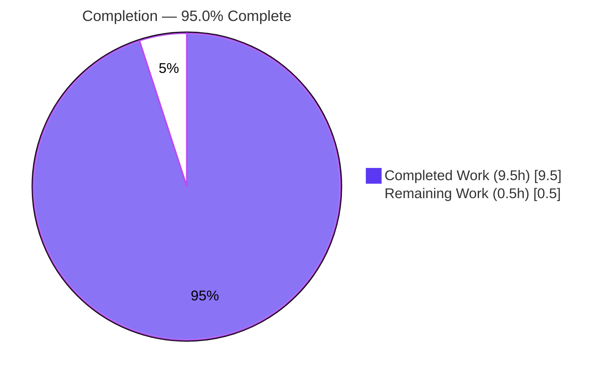
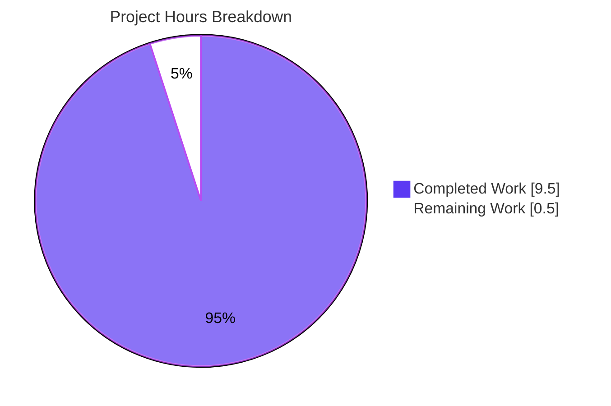
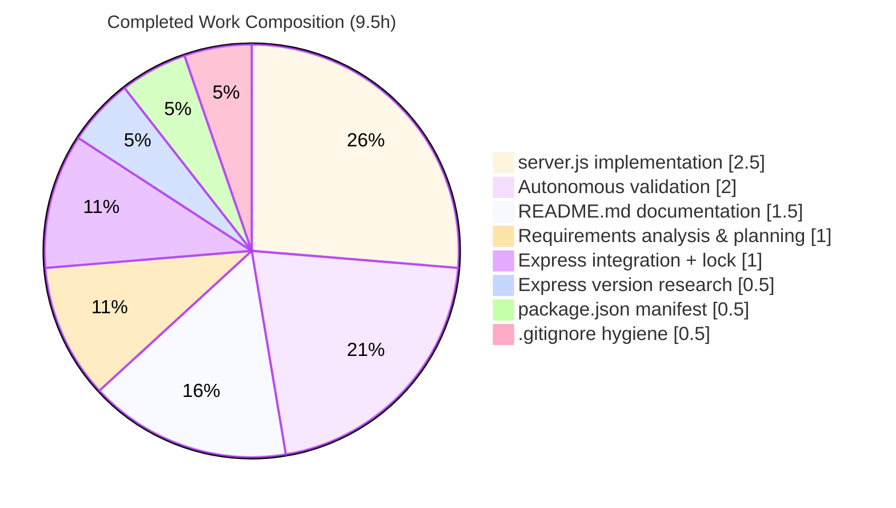

# Blitzy Project Guide — Artifact2 (Node.js + Express.js Tutorial Server)

> **Brand legend** — <span style="color:#5B39F3">**Completed / AI Work = Dark Blue (#5B39F3)**</span> · **Remaining / Not Completed = White (#FFFFFF)** · *Headings/Accents = Violet-Black (#B23AF2)* · *Highlight = Mint (#A8FDD9)*

---

## 1. Executive Summary

### 1.1 Project Overview

Artifact2 is a minimal Node.js tutorial HTTP server built on the **Express.js** framework. The feature introduces Express into a previously empty repository and exposes two plain-text `GET` endpoints — **`Hello world`** at `/` (preserved for backward compatibility) and **`Good evening`** at `/good-evening` (new, additive) — while bootstrapping the runnable project baseline (manifest, server entry, lock file) that the request assumed already existed. Target users are developers learning idiomatic Express routing. Technical scope is a single-file CommonJS Express application plus dependency manifest, generated lock file, `.gitignore`, and updated documentation. Business impact: a clean, reproducible starter that demonstrates Express routing and safe additive endpoint design.

### 1.2 Completion Status



**Center label: 95.0% Complete** · Completed = Dark Blue (#5B39F3) · Remaining = White (#FFFFFF)

| Metric | Hours |
|--------|-------|
| **Total Hours** | **10.0** |
| **Completed Hours (AI + Manual)** | **9.5** (AI: 9.5 · Manual: 0.0) |
| **Remaining Hours** | **0.5** |
| **Percent Complete** | **95.0%** |

### 1.3 Key Accomplishments

- ✅ **R1 — Baseline bootstrapped:** runnable Node.js project (`package.json` + `server.js`) created from a greenfield repo; `npm start` boots successfully.
- ✅ **R2 — Express.js introduced:** `express ^5.2.1` declared, installed, locked (`package-lock.json`, lockfileVersion 3), and `require`d in `server.js`.
- ✅ **R3 — Backward compatibility preserved:** `GET /` returns byte-exact `Hello world` (11 bytes, HTTP 200).
- ✅ **R4 — New endpoint added:** `GET /good-evening` returns byte-exact `Good evening` (12 bytes, HTTP 200).
- ✅ **All 5 in-scope files** created/updated and committed at `HEAD 6705c4b`; working tree clean.
- ✅ **Security clean:** `npm audit` reports **0 vulnerabilities** across the 66-package dependency tree.
- ✅ **Runtime validated end-to-end:** boot, both endpoints byte-exact, `404` negative test, and `PORT` override (`PORT=8080`) all confirmed.

### 1.4 Critical Unresolved Issues

| Issue | Impact | Owner | ETA |
|-------|--------|-------|-----|
| _None — all four AAP requirements (R1–R4) implemented, committed, and validated end-to-end; zero unresolved errors._ | None | — | — |

### 1.5 Access Issues

| System / Resource | Type of Access | Issue Description | Resolution Status | Owner |
|-------------------|----------------|-------------------|-------------------|-------|
| _No access issues identified_ | — | Repository is local; npm registry reachable (clean install of 66 packages verified). No external credentials or third-party services required by the AAP scope. | N/A | — |

**No access issues identified.**

### 1.6 Recommended Next Steps

1. **[High]** Perform acceptance verification & merge sign-off — clone the branch, run `npm install`, `npm start`, and `curl` both endpoints to confirm responses, then approve the PR (**0.5h**, the sole remaining in-scope task).
2. **[Low]** _(Optional, out of AAP scope)_ Add automated tests (Jest + Supertest) for the two endpoints if the project grows beyond tutorial scope.
3. **[Low]** _(Optional, out of AAP scope)_ Declare `engines.node ">=18"` in `package.json` to enforce the Express 5 runtime floor.
4. **[Low]** _(Optional, out of AAP scope)_ Add security middleware (helmet/CORS), CI/CD, containerization, and structured logging before any public production deployment.

---

## 2. Project Hours Breakdown

### 2.1 Completed Work Detail

| Component | Hours | Description |
|-----------|-------|-------------|
| Requirements analysis & planning | 1.0 | Greenfield interpretation of R1–R4, scope-boundary definition, route-path decisions (`/`, `/good-evening`). |
| Express version research | 0.5 | Web/npm-registry research to pin the current stable Express (`5.2.1`); no placeholder version used. |
| Project manifest — `package.json` (R1, R2) | 0.5 | Metadata (`name`, `version`, `description`, `main`), `start` script, `express ^5.2.1` dependency. |
| Express integration + lock file (R2) | 1.0 | `npm install`, dependency resolution (66 packages), committed `package-lock.json` (lockfileVersion 3). |
| Server implementation — `server.js` (R1, R3, R4) | 2.5 | Express app, two GET routes (byte-exact strings), `PORT` env binding, `app.listen`, documentation comments. |
| Repository hygiene — `.gitignore` (R1) | 0.5 | Excludes `node_modules/`, `npm-debug.log*`, `.env`. |
| Documentation — `README.md` | 1.5 | Overview, prerequisites, install/run, `PORT` override, endpoints table, usage examples; heading preserved. |
| Autonomous validation (path-to-production) | 2.0 | 5-gate validation: dependency tree, `node --check`, byte-exact runtime, `404` negative test, `PORT` override, audit, scope compliance. |
| **Total Completed** | **9.5** | |

### 2.2 Remaining Work Detail

| Category | Hours | Priority |
|----------|-------|----------|
| Human acceptance verification & merge sign-off (clone → `npm install` → `npm start` → `curl` both endpoints → approve PR) | 0.5 | High |
| **Total Remaining** | **0.5** | |

> _Optional future enhancements (automated tests, `engines` field, security middleware, CI/CD, monitoring) are **explicitly out of AAP scope (§0.6.2)** and carry **0 counted hours**; they are intentionally excluded from the project hour total and the completion denominator._

### 2.3 Hours Reconciliation

| Line | Hours | Check |
|------|-------|-------|
| Completed (Section 2.1) | 9.5 | = Section 1.2 Completed |
| Remaining (Section 2.2) | 0.5 | = Section 1.2 Remaining = Section 7 "Remaining Work" |
| **Total** | **10.0** | 9.5 + 0.5 = 10.0 ✓ |
| **Percent Complete** | **95.0%** | 9.5 ÷ 10.0 × 100 ✓ |

---

## 3. Test Results

All entries below originate from **Blitzy's autonomous validation logs** (Final Validator GATE 3/GATE 4) and were independently re-verified during this assessment. No automated unit/integration suite exists — automated tests are **explicitly out of scope per AAP §0.6.2**; validation is performed via runtime `curl` acceptance checks (AAP §0.5.2).

| Test Category | Framework | Total Tests | Passed | Failed | Coverage % | Notes |
|---------------|-----------|-------------|--------|--------|-----------|-------|
| Functional Acceptance (E2E) | `curl` + shell assertions | 5 | 5 | 0 | N/A* | `GET /` body+status, `GET /good-evening` body+status, `GET /nonexistent` → 404 |
| Syntax / Static Check | `node --check` | 1 | 1 | 0 | N/A | `server.js` parses cleanly (exit 0) |
| Dependency Audit | `npm audit` | 1 | 1 | 0 | N/A | 0 vulnerabilities across 66 packages |
| Automated Unit / Integration | — | 0 | 0 | 0 | N/A | Out of scope per AAP §0.6.2 — none by design |
| **Totals** | | **7** | **7** | **0** | — | 100% pass rate |

> _*Coverage instrumentation is not applicable — there is no automated unit suite (out of scope). Functional acceptance exercises **100% of the two defined endpoints** plus a negative (404) path._

---

## 4. Runtime Validation & UI Verification

**Runtime health** — validated end-to-end (Node v20.20.2 / npm 11.1.0):

- ✅ **Server boot:** `npm start` / `node server.js` → logs `Listening on 3000`.
- ✅ **`GET /`** → HTTP **200**, body exactly `Hello world` (11 bytes, byte-verified via `od -c`, no trailing newline).
- ✅ **`GET /good-evening`** → HTTP **200**, body exactly `Good evening` (12 bytes, byte-verified).
- ✅ **`GET /nonexistent`** → HTTP **404** (Express default) — confirms only the two intended routes exist.
- ✅ **`PORT` override:** `PORT=8080 npm start` → `Listening on 8080`; both endpoints serve exact strings on `:8080`.
- ✅ **Clean shutdown:** process exits cleanly; ports `3000`/`8080` freed; no lingering processes.
- ✅ **Reproducible install:** fresh checkout `npm install` → `added 66 packages`, `0 vulnerabilities`, `express@5.2.1`.

**API integration outcomes:** ✅ Operational — both endpoints reachable and byte-exact.

**UI verification:** **Not applicable.** This is a backend HTTP service returning plain-text strings; there is no front-end, rendered markup, component library, or design system (AAP §0.5.3). No UI screenshots are warranted.

---

## 5. Compliance & Quality Review

Cross-mapping of AAP deliverables and quality benchmarks to validation evidence.

| Requirement / Benchmark | Status | Evidence | Progress |
|--------------------------|--------|----------|----------|
| R1 — Runnable baseline project | ✅ Pass | `package.json` + `server.js`; `npm start` boots | 100% |
| R2 — Express.js introduced | ✅ Pass | `express ^5.2.1` declared, installed, locked, `require`d | 100% |
| R3 — `Hello world` preserved | ✅ Pass | `GET /` byte-exact, HTTP 200 | 100% |
| R4 — `Good evening` added | ✅ Pass | `GET /good-evening` byte-exact, HTTP 200 | 100% |
| Exact response payloads (byte-for-byte) | ✅ Pass | `od -c` verified, no extra whitespace/punctuation | 100% |
| Express version pinned (no placeholder) | ✅ Pass | `^5.2.1` (current stable) per AAP §0.2.2 | 100% |
| Tutorial simplicity (single-file CommonJS) | ✅ Pass | 24-line `server.js`, `require` style | 100% |
| Repository hygiene (`node_modules` ignored) | ✅ Pass | `git check-ignore node_modules` confirms | 100% |
| Documentation (`README.md`) | ✅ Pass | Install/run/PORT/endpoints documented; `# Artifact2` heading preserved | 100% |
| Dependency security | ✅ Pass | `npm audit` → 0 vulnerabilities | 100% |
| Reproducible build (lock committed) | ✅ Pass | Clean install of 66 packages from committed lock | 100% |
| All work committed (clean tree) | ✅ Pass | `HEAD 6705c4b`; `git status` empty | 100% |

**Fixes applied during autonomous validation:** None — the code-generation agents produced a correct, complete implementation. Validation was read-only confirmation and made zero file modifications.

**Outstanding compliance items:** Human acceptance sign-off only (0.5h, Section 2.2).

---

## 6. Risk Assessment

| Risk | Category | Severity | Probability | Mitigation | Status |
|------|----------|----------|-------------|------------|--------|
| No automated regression tests | Technical | Low | Medium | Out of scope (AAP §0.6.2); manual curl acceptance (5/5) covers current behavior; add Jest+Supertest if project grows | Accepted (by scope) |
| Node.js version drift below 18 breaks Express 5 | Technical | Medium | Low | README documents "Node 18+"; Express `engines` = `">= 18"`; env verified Node 20. Optional: add `engines.node` to `package.json` | Mitigated |
| npm registry unavailable on first install | Integration | Low | Low | `package-lock.json` (lockfileVersion 3) committed for reproducible resolution; standard npm connectivity assumed | Mitigated |
| Port 3000 already in use on host | Operational | Low | Low | `PORT` env override documented and verified (`PORT=8080`) | Mitigated |
| No security middleware (helmet/CORS/rate-limiting) | Security | Low | Low | Out of scope; serves only public static strings, no sensitive data or auth surface; add before public exposure | Accepted (by scope) |
| No structured logging / monitoring / health route | Operational | Low | Low | Out of scope; boot log present; `/` can serve as liveness; add observability for production | Accepted (by scope) |
| No CI/CD pipeline or containerization | Operational / Integration | Low | Low | Out of scope (AAP §0.6.2); manual install/run fully documented | Accepted (by scope) |

**Summary:** Zero HIGH-severity risks. One MEDIUM (Node version drift) with Low probability, already mitigated via documentation. All others are Low and either mitigated or accepted-by-design (intentional AAP scope decisions). `npm audit` reports 0 vulnerabilities, so there is no open dependency-vulnerability risk.

---

## 7. Visual Project Status



- **Completed Work = 9.5h** (Dark Blue #5B39F3) · **Remaining Work = 0.5h** (White #FFFFFF).
- "Remaining Work" (0.5h) matches Section 1.2 Remaining Hours and the Section 2.2 total exactly.

**Completed work by component (hours):**



**Remaining hours by category (from Section 2.2):**

| Category | Hours | Priority |
|----------|-------|----------|
| Human acceptance verification & merge sign-off | 0.5 | High |
| **Total** | **0.5** | |

---

## 8. Summary & Recommendations

**Achievements.** The Artifact2 feature is **95.0% complete** and functionally finished for its defined scope. All four AAP requirements (R1–R4) are implemented, committed (`HEAD 6705c4b`), and validated end-to-end: the project baseline was bootstrapped from an empty repository, Express.js `5.2.1` was introduced as the HTTP framework, the original `Hello world` response was preserved at `/`, and the new `Good evening` endpoint was added at `/good-evening` — both byte-exact with HTTP 200. The dependency tree is clean (0 vulnerabilities) and reproducible from the committed lock file.

**Remaining gaps.** A single 0.5h task remains: **human acceptance verification & merge sign-off**. This is a path-to-production gate that an autonomous agent cannot discharge — a human must confirm acceptance in their own environment and make the merge decision. The project is intentionally held below 100% to reserve this human verification step (per honest-assessment guidance).

**Critical path to production.** Clone the branch → `npm install` → `npm start` → `curl` both endpoints → approve and merge. No code changes are required.

**Production readiness.** **Ready for the defined tutorial scope.** Everything the AAP specified is delivered and verified. Items such as automated tests, security middleware, CI/CD, containerization, and monitoring are **explicitly out of scope (AAP §0.6.2)**; their absence is correct by design and should only be revisited if the project evolves beyond its tutorial purpose.

| Success Metric | Target | Actual | Status |
|----------------|--------|--------|--------|
| AAP requirements satisfied (R1–R4) | 4/4 | 4/4 | ✅ |
| In-scope files delivered | 5/5 | 5/5 | ✅ |
| Functional acceptance assertions | 5/5 pass | 5/5 pass | ✅ |
| Dependency vulnerabilities | 0 | 0 | ✅ |
| Byte-exact endpoint responses | 2/2 | 2/2 | ✅ |
| Completion | — | 95.0% | ✅ |

---

## 9. Development Guide

> Every command below was tested during this assessment from a clean checkout (Node v20.20.2 / npm 11.1.0).

### 9.1 System Prerequisites

- **Node.js ≥ 18** (required by Express 5; tested on v20.20.2). Verify: `node --version`
- **npm** (bundled with Node.js; tested on 11.1.0). Verify: `npm --version`
- **OS:** any Linux/macOS/Windows environment that runs Node.js. **Hardware:** negligible (single lightweight process).
- **Network:** access to the public npm registry for the first `npm install`.

### 9.2 Environment Setup

No environment variables are required. One **optional** variable is supported:

- `PORT` — TCP port the server listens on. Defaults to `3000` when unset.

```bash
# Optional: choose a custom port for the session
export PORT=8080
```

### 9.3 Dependency Installation

```bash
# From the repository root
npm install
```

Expected output (abridged):

```
added 66 packages, and audited 67 packages in <time>
found 0 vulnerabilities
```

For a strictly reproducible install from the committed lock file (recommended for CI or verification):

```bash
npm ci
```

Verify the dependency tree:

```bash
npm ls
# artifact2@1.0.0 <path>
# └── express@5.2.1
```

### 9.4 Application Startup

```bash
# Default port 3000
npm start
# > artifact2@1.0.0 start
# > node server.js
# Listening on 3000
```

```bash
# Custom port
PORT=8080 npm start
# Listening on 8080
```

> Tip: run in the background with `npm start &` (capture the PID with `echo $!`) and stop it later with `kill <pid>`.

### 9.5 Verification Steps

With the server running on port 3000:

```bash
curl http://localhost:3000/             # -> Hello world
curl http://localhost:3000/good-evening # -> Good evening
```

Check status codes and byte-exactness:

```bash
curl -s -o /dev/null -w "%{http_code}\n" http://localhost:3000/             # -> 200
curl -s -o /dev/null -w "%{http_code}\n" http://localhost:3000/good-evening # -> 200
curl -s -o /dev/null -w "%{http_code}\n" http://localhost:3000/nonexistent  # -> 404
curl -s http://localhost:3000/ | od -c   # -> H e l l o   w o r l d  (11 bytes, no trailing newline)
```

Static syntax check (no run):

```bash
node --check server.js   # exit 0 = OK
```

### 9.6 Example Usage

| Method | Path | Response | Status |
|--------|------|----------|--------|
| `GET` | `/` | `Hello world` | 200 |
| `GET` | `/good-evening` | `Good evening` | 200 |
| `GET` | _(any other path)_ | Express default Not Found | 404 |

### 9.7 Troubleshooting

| Symptom | Cause | Resolution |
|---------|-------|------------|
| `Error: listen EADDRINUSE :::3000` | Port 3000 already in use | Run on another port: `PORT=8080 npm start`, or free port 3000 |
| `Error: Cannot find module 'express'` | Dependencies not installed | Run `npm install` (or `npm ci`) first |
| `SyntaxError` / unexpected token on boot | Node.js older than 18 | Upgrade Node (`node --version` must be ≥ 18) |
| Endpoint returns 404 unexpectedly | Wrong path | Use exactly `/` or `/good-evening` (paths are case-sensitive) |
| Need a pristine dependency tree | Corrupted `node_modules` | `rm -rf node_modules && npm ci` (reinstalls from the committed lock without changing it) |

---

## 10. Appendices

### Appendix A — Command Reference

| Command | Purpose |
|---------|---------|
| `node --version` | Confirm Node.js ≥ 18 |
| `npm --version` | Confirm npm present |
| `npm install` | Install dependencies (Express + transitive) |
| `npm ci` | Reproducible install from committed lock file |
| `npm start` | Start the server (`node server.js`) |
| `PORT=8080 npm start` | Start on a custom port |
| `npm ls` | Show resolved dependency tree |
| `npm audit` | Check for dependency vulnerabilities |
| `node --check server.js` | Static syntax check (no execution) |
| `curl http://localhost:3000/` | Smoke-test the `Hello world` endpoint |
| `curl http://localhost:3000/good-evening` | Smoke-test the `Good evening` endpoint |

### Appendix B — Port Reference

| Port | Service | Configurable Via | Default |
|------|---------|------------------|---------|
| 3000 | Express HTTP server | `PORT` env var | Yes (default) |
| 8080 | Example custom port | `PORT=8080` | Example only |

### Appendix C — Key File Locations

| File | Status | Role |
|------|--------|------|
| `server.js` | CREATE | Express app entry point; defines both routes + listener (24 lines) |
| `package.json` | CREATE | Manifest: metadata, `start` script, `express ^5.2.1` (12 lines) |
| `package-lock.json` | CREATE (generated) | Locked dependency tree, lockfileVersion 3 (843 lines) |
| `.gitignore` | CREATE | Excludes `node_modules/`, `npm-debug.log*`, `.env` (3 lines) |
| `README.md` | UPDATE | Install/run/endpoint documentation; `# Artifact2` heading preserved (50 lines) |
| `node_modules/` | Generated | Installed packages (git-ignored, not committed) |

### Appendix D — Technology Versions

| Technology | Version | Notes |
|------------|---------|-------|
| Node.js | v20.20.2 (env) | AAP requires ≥ 18 for Express 5 |
| npm | 11.1.0 | Bundled with Node.js |
| Express | 5.2.1 | Declared `^5.2.1`; resolved 5.2.1 |
| Lockfile format | lockfileVersion 3 | npm v7+ format |
| Module system | CommonJS | `require` style per AAP |

### Appendix E — Environment Variable Reference

| Variable | Required | Default | Purpose |
|----------|----------|---------|---------|
| `PORT` | No | `3000` | TCP port the HTTP server binds to |

### Appendix F — Developer Tools Guide

- **Run/debug locally:** `npm start` (foreground) or `npm start &` (background; stop with `kill <pid>`).
- **Inspect dependencies:** `npm ls`, `npm audit`.
- **Static check:** `node --check server.js`.
- **Byte-level response inspection:** pipe `curl` output through `od -c` to confirm exact bytes and absence of trailing newline.
- **Version control:** all five in-scope files are tracked; `node_modules/` is git-ignored — never commit it.

### Appendix G — Glossary

| Term | Definition |
|------|------------|
| AAP | Agent Action Plan — the authoritative requirements specification for this feature. |
| Express.js | Minimal Node.js web framework providing routing and response helpers. |
| Endpoint / Route | A path + HTTP method pair handled by the server (e.g., `GET /good-evening`). |
| Byte-exact | Response body matches the specified string with no extra whitespace, punctuation, or trailing newline. |
| Lock file | `package-lock.json`; pins the fully resolved dependency graph for reproducible installs. |
| Greenfield | A project starting from an empty/near-empty repository with no prior code. |
| Path-to-production | Standard activities required to deploy/accept a deliverable beyond writing the code itself. |

---

*Cross-section integrity verified: Remaining hours = 0.5h in Sections 1.2, 2.2, and 7. Section 2.1 (9.5) + Section 2.2 (0.5) = Total 10.0h. Completion 95.0% consistent across Sections 1.2, 2.3, 7, and 8. All tests in Section 3 originate from Blitzy's autonomous validation logs. Colors: Completed = #5B39F3, Remaining = #FFFFFF.*